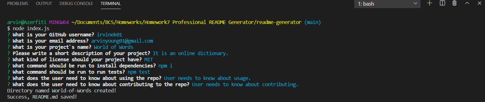
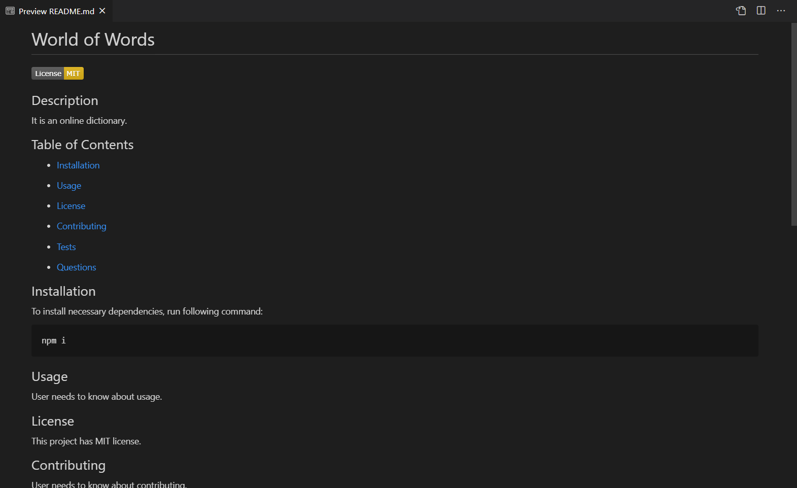

# 09 Node.js Homework: Professional README Generator

## Description
This is a command-line application that generates README.md files by asking a series of questions, allows the project creator to devote more time to working on the project.  
The task is completed through a user's input using the Inquirer package.

### Usage
The application will be invoked by using the following command:

```bash
node index.js
```

- A sample for the command-line application.  

- A sample result generated by the app itself.  

- A link for an instructional demonstration of the command-line app. 
https://drive.google.com/file/d/1LOohM8Nc_PEDTWMIHjD68W7p31tzv6z3/view?usp=sharing
